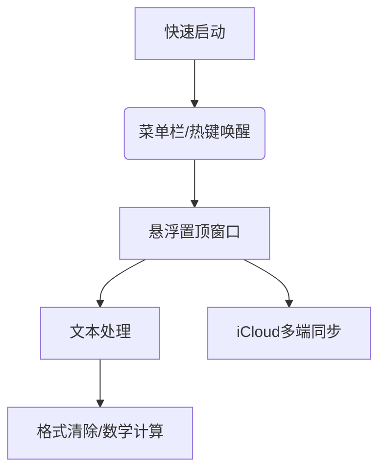

## 为什么你需要这个「数字便签纸」

作为深度Mac/iOS用户，您是否经常遇到这些场景：
- 需要临时记录代码片段却不想打开笨重的IDE
- 填写在线表单时需先清除复制的格式
- 视频会议中想快速计算数值却找不到计算器
- 在多设备间传递文本片段时反复登录聊天工具

**Scrap Paper** 正是为解决这些痛点而生！这款设计理念为「零干扰」的纯文本工具，将重新定义你的碎片信息处理方式。

## ✨ 核心功能全景图


### 🚀 效率增强特性
| 功能 | 使用场景 | 操作路径 |
|------|----------|----------|
| **全局置顶** | 全屏操作时查看笔记 | 开启"在所有空间显示" |
| **闪电启动** | 瞬时记录灵感 | 可以悬浮在菜单栏，或者设置快捷键 |
| **自动复制** | 快速转移文本 | 设置 → 启用选择后自动复制 |
| **数学计算** | 即时数值计算 | 右键 → 解决数学问题 |
| **纯净导出** | 清除格式粘贴 | 导出至邮件/消息/备忘录 |

### 🔢 隐藏技能：内置计算器
```markdown
1. 输入数学表达式：`(15*3+7)/4`
2. 选中表达式 → 右键单击
3. 选择"解决数学问题"
4. 自动追加结果：`=13`
```
> 💡 支持复杂运算：括号优先级/百分比/平方根等，**本地计算**保障隐私安全

## 🎯 真实使用场景
### 案例1：开发者的救星
```ruby
# 调试时快速记录变量值
user_id = current_session[:id] 
# 选中 → 右键计算 → 得结果：11582
```

### 案例2：随处扫描文本
```markdown
直接用scantext扫描，然后用scrap paper处理
```

### 案例3：跨设备协作
```mermaid
sequenceDiagram
   Mac->>iCloud： 保存会议要点
   iCloud->>iPhone： 实时同步
   iPhone->>iPad： 隔空投送修改版
```

## ⚡ 为什么选择Scrap Paper
1. **零认知负担**：启动速度<0.5秒，比打开备忘录快3倍
2. **无干扰设计**：纯文本界面杜绝花哨功能干扰
3. **空间管理术**：悬浮窗口仅占用240×180像素
4. **生态无缝衔接**：完美融入Apple原生应用生态

## 进阶设置技巧
```yaml
# ~/.config/scrap-paper/settings.yaml
hotkey: control+option+command+space  # 推荐改至空格键
font: Menlo-14                        # 程序员首选等宽字体
autostart: true                       # 登录自启
theme: solarized-dark                 # 护眼暗色主题
```

---

> ✍️ **体验建议**：下次当您需要临时记录时，尝试用Scrap Paper替代默认备忘录。这个设计克制的工具，可能会成为您效率工具链中最惊喜的存在。 

[扫码下载]


---

期待与你同行➡️

▁▂▃▅▆▇ 龟·兔·光·影 ▇▆▅▃▂▁  
　　　　           ◤ 876 ◢  
　　            🐢　.　*　.　🐇  

—————–认知持续部署中—————

━━━━◈ 𝟮𝟬𝟮𝟱.𝟬𝟲.𝟬𝟭 ◈━━━━━

